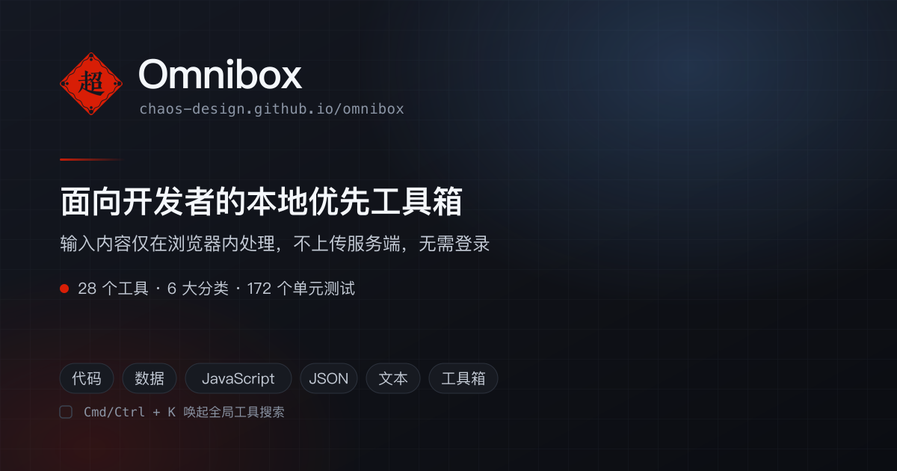

<div align="center">



# Omnibox

**面向开发者的本地优先工具箱。输入内容仅在浏览器内处理，不上传服务端。**

[](https://chaos-design.github.io/omnibox)
[](https://nextjs.org)
[](./LICENSE)

[在线使用](https://chaos-design.github.io/omnibox) · [问题反馈](https://github.com/chaos-design/omnibox/issues)

</div>

---

## 特性

- **零后端**　纯静态站点，部署在 GitHub Pages，无服务端、无数据库
- **数据不出浏览器**　所有转换在客户端完成，草稿仅存于 `localStorage`
- **免登录**　打开即用，不收集任何账号信息
- **键盘优先**　`Cmd/Ctrl + K` 全局搜索直达任意工具
- **可离线**　首次加载后可脱离网络使用（Monaco 编辑器已自托管）

## 工具一览

28 个工具，按 6 个分类组织。

### 代码

| 工具 | 说明 |
| --- | --- |
| [代码对比](https://chaos-design.github.io/omnibox/code/diff/) | 并排检查文本或代码改动 |
| [代码美化](https://chaos-design.github.io/omnibox/code/format/) | 多语言代码格式化，基于 Prettier |

### JSON

| 工具 | 说明 |
| --- | --- |
| [JSON 工作台](https://chaos-design.github.io/omnibox/json/stringify-parse/) | 格式化、压缩、转义、键排序，多标签草稿与本地恢复 |

### 数据

| 工具 | 说明 |
| --- | --- |
| [CSV / JSON](https://chaos-design.github.io/omnibox/data/csv-json/) | 两种格式双向转换 |
| [XML](https://chaos-design.github.io/omnibox/data/xml/) | 格式化、压缩与 XPath 查询 |
| [JSON Pointer](https://chaos-design.github.io/omnibox/data/json-pointer/) | RFC 6901 查询与修改 |

### JavaScript

| 工具 | 说明 |
| --- | --- |
| [转 TypeScript](https://chaos-design.github.io/omnibox/js/to-ts/) | JSON / JS 对象生成类型定义 |
| [转 JSON Schema](https://chaos-design.github.io/omnibox/js/to-schema/) | JSON / JS 对象生成 JSON Schema |

### 文本

| 工具 | 说明 |
| --- | --- |
| [文本编码](https://chaos-design.github.io/omnibox/text/codec/) | Base64、Base64URL、URL、HTML 实体编解码 |
| [文本处理](https://chaos-design.github.io/omnibox/text/transform/) | 命名格式转换、空白与行处理、文本统计 |
| [正则测试](https://chaos-design.github.io/omnibox/text/regex/) | 匹配、捕获组与替换预览 |
| [Unicode](https://chaos-design.github.io/omnibox/text/unicode/) | 代码点、转义与归一化分析 |

### 工具箱

| 工具 | 说明 |
| --- | --- |
| [哈希与随机值](https://chaos-design.github.io/omnibox/kits/hash-random/) | SHA 哈希、UUID、安全随机字符串 |
| [JWT 解码](https://chaos-design.github.io/omnibox/kits/jwt/) | 载荷解码与标准 Claims 状态检查 |
| [HMAC](https://chaos-design.github.io/omnibox/kits/hmac/) | HMAC-SHA 消息认证码生成 |
| [HTTP 代码生成](https://chaos-design.github.io/omnibox/kits/http-builder/) | cURL、Fetch 与原始 HTTP 请求 |
| [SSE 消息预览](https://chaos-design.github.io/omnibox/kits/sse-preview/) | 事件流行级解析、帧装配与事件派发可视化 |
| [时间戳](https://chaos-design.github.io/omnibox/kits/timestamp/) | 秒 / 毫秒时间戳与日期双向转换 |
| [进制转换](https://chaos-design.github.io/omnibox/kits/radix/) | 大整数转为二、八、十、十六进制 |
| [URL 解析](https://chaos-design.github.io/omnibox/kits/url-parser/) | 组成部分拆解与查询参数分析 |
| [颜色与对比度](https://chaos-design.github.io/omnibox/kits/color/) | HEX / RGB / HSL 转换与 WCAG 对比度 |
| [数据大小](https://chaos-design.github.io/omnibox/kits/data-size/) | SI 与 IEC 单位换算 |
| [IPv4 / CIDR](https://chaos-design.github.io/omnibox/kits/ip-cidr/) | 子网计算与地址段分析 |
| [SemVer](https://chaos-design.github.io/omnibox/kits/semver/) | 解析、比较、递增与范围判断 |
| [Unix 权限](https://chaos-design.github.io/omnibox/kits/chmod/) | 权限位与八进制互转 |
| [Cron](https://chaos-design.github.io/omnibox/kits/cron/) | 表达式解析与执行时间预览 |
| [Data URL](https://chaos-design.github.io/omnibox/kits/data-url/) | Data URL 编解码与文件下载 |
| [二维码](https://chaos-design.github.io/omnibox/kits/qrcode/) | Canvas / SVG 二维码生成与下载 |

## 技术栈

| 领域 | 选型 |
| --- | --- |
| 框架 | Next.js 16（App Router）· React 19 |
| 部署 | 静态导出（`output: 'export'`）→ GitHub Pages |
| 样式 | Tailwind CSS 4 + CSS Modules |
| 编辑器 | Monaco Editor（自托管，不依赖 CDN） |
| 格式化 | Prettier（按需动态加载 parser） |
| 校验 | TypeScript 6 · Biome 2 |
| 测试 | Vitest 4 |

## 本地开发

环境要求：Node.js 22.22.3+、pnpm 11.18.0+

```bash
pnpm install
pnpm dev
```

访问 <http://localhost:5454>。

`pnpm install` 会顺带把 `monaco-editor` 的运行时资源从 `node_modules` 复制到 `public/monaco`（由 `scripts/sync-monaco.mjs` 完成），使编辑器完全由本站提供。该目录已被 `.gitignore` 忽略，请勿手动提交。

### 可用脚本

| 命令 | 说明 |
| --- | --- |
| `pnpm dev` | 启动开发服务器（端口 5454） |
| `pnpm build` | 静态导出到 `out/` |
| `pnpm start` | 预览生产构建 |
| `pnpm check` | 完整门禁：lint → 类型 → 测试 → 构建 |
| `pnpm lint` | Biome 规则检查 |
| `pnpm typecheck` | TypeScript 类型检查 |
| `pnpm test` | Vitest 单元测试 |
| `pnpm format` | Biome 自动格式化 |
| `pnpm menu` | 重新生成工具菜单 |

### 生成主图

```bash
node scripts/generate-og.mjs
```

输出 `public/og.png` 与 `public/og.svg`（1200×630）。配色取自 `src/app/globals.css` 的暗色主题变量，改主题时需同步更新脚本内的 `tokens`。

## 部署

推送到 `main` 分支即触发 [`.github/workflows/deploy.yml`](./.github/workflows/deploy.yml)：校验通过后静态导出并发布至 GitHub Pages。

仓库名决定站点子路径（`chaos-design.github.io/omnibox`），构建时会自动注入 `basePath`，无需额外配置。

## 贡献

欢迎提交 Issue 与 Pull Request。提交前请确保 `pnpm check` 全部通过。

## 许可证

[MIT](./LICENSE)
